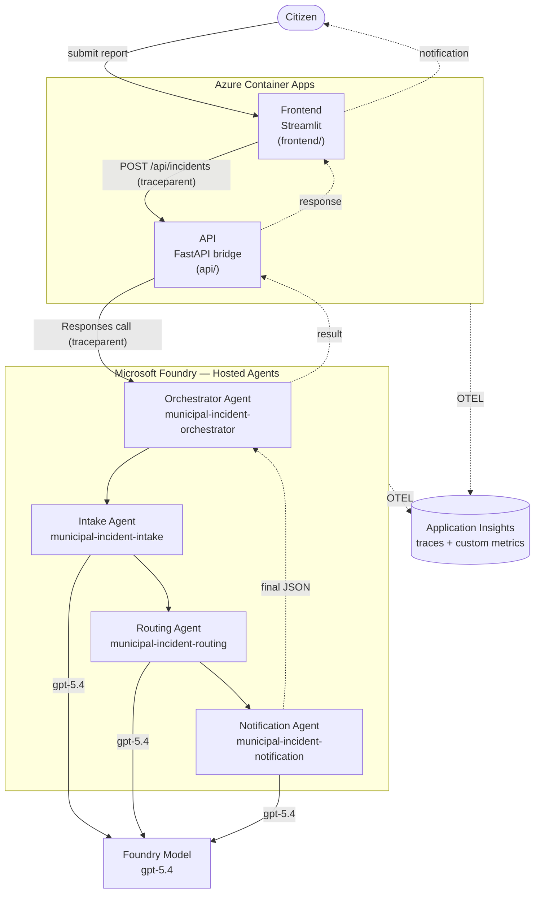
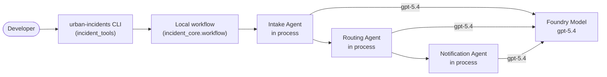
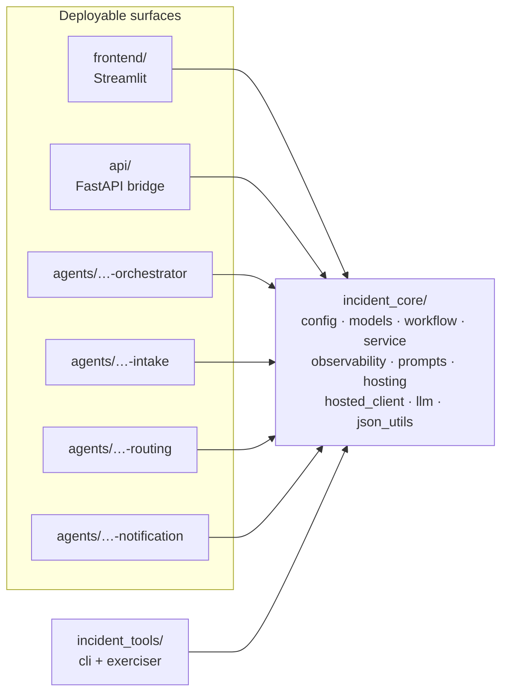

# Urban Incident Agents

Municipal incident triage app with a Streamlit frontend, FastAPI API, Microsoft Agent Framework, Microsoft Foundry hosted worker agents, and Azure Container Apps.

## Purpose

Urban Incident Agents is a municipal incident triage system. Citizens submit free-text reports about public-space issues such as streetlights, potholes, fallen trees, blocked sidewalks, water leaks, overflowing bins, vandalism, noise complaints, and traffic hazards.

The system uses a multi-agent workflow to classify the report, assess urgency, route it to the correct municipal department, and generate a clear citizen-facing notification.

## Main Systems

The repository is organized by independently understandable and deployable systems.

### Frontend

The frontend is a Streamlit web form. It exposes a single text area and send button for citizen reports. It does not contain workflow logic. It sends the report to the orchestrator API and displays the final classification, priority, department, citizen message, and operational details.

### Orchestrator

The orchestrator is the system boundary for the complete workflow. It has two roles:

- A FastAPI bridge for the Streamlit frontend.
- A Foundry hosted-agent compatible workflow agent.

The local orchestrator is aligned with the Microsoft Agent Framework agents-in-workflows samples. It can build three Agent Framework agents, wrap them with `AgentExecutor` using last-agent context, and wire them with `WorkflowBuilder` for local development.

The deployed application path uses the FastAPI bridge to call the deployed Foundry hosted orchestrator agent. The hosted orchestrator calls the deployed Intake, Routing, and Notification hosted agents. That means all four agents remain separate Foundry control-plane resources with their own versions, traces, metrics, and cost attribution.

This means the full flow can be run as one deployable orchestrator agent, while the individual agents can also be deployed and invoked independently.

### Intake Agent

The Intake Agent reads the citizen report and extracts operational facts:

- Whether the report is an urban incident.
- Incident type.
- Location.
- Affected public assets.
- Risk indicators.
- Missing details.
- A concise operational summary.

It rejects reports that are not related to municipal urban incidents.

### Routing Agent

The Routing Agent receives the intake output and evaluates urgency and ownership. It determines:

- Priority.
- SLA target.
- Responsible department.
- Escalation requirement.
- Rationale.
- Suggested work order details.

The routing logic considers public safety, traffic and pedestrian impact, sensitive locations such as hospitals and schools, escalation potential, and issue type.

### Notification Agent

The Notification Agent receives the intake and routing outputs and writes the final citizen-facing response. It explains:

- How the report was classified.
- The assigned priority.
- Which department owns the case.
- What the expected next steps are.
- What additional information is needed, if any.

It avoids overpromising and does not invent ticket IDs or completion guarantees.

## Runtime Flow

At a high level, the workflow is:

```text
Citizen -> Frontend -> Orchestrator -> Intake Agent -> Routing Agent -> Notification Agent
```

The response flows back through the orchestrator to the frontend.

### Deployed Architecture (Hosted Mode)

The diagram below shows the deployed path: the Streamlit frontend and FastAPI
bridge run on Azure Container Apps, the FastAPI bridge calls the Foundry hosted
orchestrator agent, and the orchestrator coordinates the three worker agents in
sequence. Every component propagates W3C trace context and exports telemetry to
the same Application Insights resource.



### Local Orchestrated Mode

With `ORCHESTRATION_BACKEND=local`, the CLI runs the workflow in process: the
shared workflow builds the three agents as `AgentExecutor` steps that call the
Foundry model directly, without deploying any hosted agent.



The final response object contains:

- Workflow status.
- Correlation ID.
- Intake result.
- Routing result.
- Notification result.

## Deployment Modes

The system supports multiple deployment and execution modes.

### Local Orchestrated Mode

The orchestrator runs locally and creates the three Agent Framework agents in process. Each agent calls the configured Foundry model. This is useful for local development and fast end-to-end testing without deploying the hosted agents.

### Independent Hosted Agents

Each of the three agents can be deployed independently as a Foundry Hosted Agent:

- Intake Agent.
- Routing Agent.
- Notification Agent.

This mode allows each agent to be invoked, scaled, tested, observed, and versioned independently.

### Hosted Coordinator Agent

The orchestrator is deployed as a Foundry Hosted Agent. In this mode, the complete workflow is exposed as a single Responses-compatible hosted coordinator. Internally, it calls the deployed Intake, Routing, and Notification agents in sequence through Agent Framework workflow composition.

Set `CHILD_AGENT_MODE=framework` to call the hosted Microsoft Agent Framework child agents. Set `CHILD_AGENT_MODE=prompt` to call the Foundry prompt/declarative child agents with `-dcl` names. Use `CHILD_AGENT_MODE=custom` when you want to provide explicit child agent names.

This is the hosted entrypoint used by the ACA frontend/API deployment path.

### Frontend and API on Azure Container Apps

The Streamlit frontend and FastAPI bridge can be deployed to Azure Container Apps. The FastAPI bridge can either run the workflow itself for local development or call the deployed hosted orchestrator agent.

## Foundry Integration

The system uses Microsoft Foundry in three ways:

- Model access through the configured Foundry project and model deployment.
- Hosted-agent deployment through Foundry Agent Service.
- Observability through Application Insights and Foundry Control Plane trace correlation.

The Foundry project endpoint is configured through `FOUNDRY_PROJECT_ENDPOINT`, for example:

```text
https://<YOUR-RESOURCE>.services.ai.azure.com/api/projects/<YOUR-PROJECT>
```

The configured model deployment is:

```text
gpt-5.4
```

## Observability

Each agent entrypoint and the orchestrator configure OpenTelemetry instrumentation. When an Application Insights connection string is provided, traces are exported to the Application Insights resource associated with the Foundry project.

The code emits agent creation spans with generative AI semantic attributes so Foundry Control Plane can correlate traces with registered or hosted agents.

The frontend, FastAPI bridge, hosted orchestrator, and worker hosted agents use W3C trace-context propagation. The frontend injects trace headers into API calls, and the API injects trace headers into deployed Responses calls. For a complete end-to-end trace, every component should export to the same Application Insights resource, and each network hop must preserve the `traceparent` context.

The observability goals are:

- Trace each workflow execution.
- Correlate frontend, API, orchestrator, and agent spans when trace context is preserved.
- Observe model calls.
- Correlate agent activity by agent ID and name.
- Support Foundry Control Plane monitoring for custom and hosted agents.

## Ownership Boundaries

Each deployable owns its own runtime and deployment assets:

- `incident_core/` owns the shared library: configuration, models, observability, JSON helpers, the Foundry model client, prompt loading, the local and hosted workflows, the hosted-agent client, and the request dispatcher used by every surface.
- `incident_tools/` owns the local developer scripts: the CLI (`urban-incidents`) and the hosted orchestrator exerciser (`urban-incidents-exerciser`).
- `api/` owns the FastAPI bridge, its container, and its Container Apps descriptor.
- `frontend/` owns the Streamlit app, frontend container, and frontend Container Apps descriptor.
- `agents/municipal-incident-orchestrator/` owns the hosted coordinator entrypoint, container, requirements, and Foundry metadata.
- `agents/municipal-incident-intake/` owns the Intake Agent prompt, entrypoint, container, requirements, and Foundry metadata.
- `agents/municipal-incident-routing/` owns the Routing Agent prompt, entrypoint, container, requirements, and Foundry metadata.
- `agents/municipal-incident-notification/` owns the Notification Agent prompt, entrypoint, container, requirements, and Foundry metadata.
- This `README.md` owns the architecture overview plus the Azure infrastructure and deployment setup guidance below.
- `docs/` owns reusable operational templates such as the optional GitHub Actions workflow.

This keeps deployable concerns close to the system that owns them and avoids a central mixed deployment-assets folder.

The shared library sits at the center: every deployable surface and local tool
imports `incident_core`, while each surface owns its own entrypoint, container,
and deployment descriptor.



## Design Intent

The architecture intentionally supports two complementary operating models:

- Independent agents for isolated deployment, testing, versioning, and observability.
- A full workflow orchestrator for end-to-end citizen incident processing.

This gives the city operations workflow flexibility: teams can inspect or improve each agent separately, while applications can still call one complete incident-processing flow.

---

## Setup and Deployment

The following numbered steps cover local development first, then the full Azure deployment of the four Foundry agents plus the API and frontend on Azure Container Apps.

## 1. Install Local Dependencies

```bash
cp .env.example .env
az login
python3 -m venv .venv
source .venv/bin/activate
pip install -e ".[dev,api,frontend,hosted,observability]"
```

Set `.env`:

```bash
FOUNDRY_PROJECT_ENDPOINT=https://<foundry-account-name>.services.ai.azure.com/api/projects/<foundry-project-name>
AZURE_AI_MODEL_DEPLOYMENT_NAME=gpt-5.4
ORCHESTRATION_BACKEND=local
APPLICATIONINSIGHTS_CONNECTION_STRING=<foundry-app-insights-connection-string>
ORCHESTRATOR_AGENT_NAME=municipal-incident-orchestrator
CHILD_AGENT_MODE=framework
INTAKE_AGENT_NAME=municipal-incident-intake
ROUTING_AGENT_NAME=municipal-incident-routing
NOTIFICATION_AGENT_NAME=municipal-incident-notification
```

`CHILD_AGENT_MODE` controls which deployed child agents the hosted orchestrator
calls:

- `framework`: use the hosted Microsoft Agent Framework child agents.
- `prompt`: use the Foundry prompt/declarative child agents ending in `-dcl`.
- `custom`: use `INTAKE_AGENT_NAME`, `ROUTING_AGENT_NAME`, and
  `NOTIFICATION_AGENT_NAME` exactly as configured.

## 2. Run Local CLI

```bash
ORCHESTRATION_BACKEND=local \
urban-incidents --pretty "Water leak near City Hospital is flooding the road"
```

## 3. Run Local API And Frontend

Terminal 1:

```bash
ORCHESTRATION_BACKEND=local \
uvicorn app:app --app-dir api --reload --host 0.0.0.0 --port 8000
```

Terminal 2:

```bash
INCIDENT_API_URL=http://localhost:8000 \
streamlit run frontend/app.py --server.port 8501
```

Open:

```text
http://localhost:8501
```

## 4. Set Azure Variables

```bash
LOCATION="<azure-region>"
APP_RG="<resource-group>"

ACR_NAME="<acr-name>"
ACA_ENV_NAME="<container-apps-env-name>"
ACA_API_NAME="<api-container-app-name>"
ACA_FRONTEND_NAME="<frontend-container-app-name>"

FOUNDRY_ACCOUNT_NAME="<foundry-account-name>"
FOUNDRY_PROJECT_NAME="<foundry-project-name>"
FOUNDRY_PROJECT_ENDPOINT="https://<foundry-account-name>.services.ai.azure.com/api/projects/<foundry-project-name>"
FOUNDRY_PROJECT_ID=$(az resource list \
  --resource-type Microsoft.CognitiveServices/accounts/projects \
  --query "[?name=='$FOUNDRY_ACCOUNT_NAME/$FOUNDRY_PROJECT_NAME'].id | [0]" \
  -o tsv)
AZURE_AI_MODEL_DEPLOYMENT_NAME="<model-name>"

APP_INSIGHTS_NAME="<foundry-connected-app-insights-name>"
APP_INSIGHTS_RG="$APP_RG"

IMAGE_TAG=$(date +%Y%m%d%H%M%S)
```

## 5. Prepare Azure CLI

```bash
az login
az upgrade
az extension add --name containerapp --upgrade --allow-preview true
az extension add --name application-insights --upgrade

azd auth login
azd ext install azure.ai.agents

az provider register --namespace Microsoft.App
az provider register --namespace Microsoft.OperationalInsights
az provider register --namespace Microsoft.ContainerRegistry
```

## 6. Create Azure Resources

```bash
az group create \
  --name "$APP_RG" \
  --location "$LOCATION"

az acr create \
  --resource-group "$APP_RG" \
  --name "$ACR_NAME" \
  --sku Standard \
  --location "$LOCATION" \
  --role-assignment-mode rbac-abac

az containerapp env create \
  --name "$ACA_ENV_NAME" \
  --resource-group "$APP_RG" \
  --location "$LOCATION" \
  --logs-destination none

ACR_ID=$(az acr show --name "$ACR_NAME" --resource-group "$APP_RG" --query id -o tsv)
ACR_LOGIN_SERVER=$(az acr show --name "$ACR_NAME" --resource-group "$APP_RG" --query loginServer -o tsv)

APPLICATIONINSIGHTS_CONNECTION_STRING=$(az monitor app-insights component show \
  --app "$APP_INSIGHTS_NAME" \
  --resource-group "$APP_INSIGHTS_RG" \
  --query connectionString \
  -o tsv)
```

## 7. Grant ACR Build Access

```bash
CALLER_OBJECT_ID=$(az ad signed-in-user show --query id -o tsv 2>/dev/null)

if [ -z "$CALLER_OBJECT_ID" ]; then
  CALLER_OBJECT_ID=$(az account show --query user.name -o tsv)
fi

for ROLE in \
  "Container Registry Repository Writer" \
  "Container Registry Repository Reader" \
  "Container Registry Repository Catalog Lister"; do
  az role assignment create \
    --assignee "$CALLER_OBJECT_ID" \
    --role "$ROLE" \
    --scope "$ACR_ID"
done
```

## 8. Configure azd

```bash
azd env new <azd-environment-name>

azd env set AZURE_TENANT_ID "$(az account show --query tenantId -o tsv)"
azd env set AZURE_SUBSCRIPTION_ID "$(az account show --query id -o tsv)"
azd env set AZURE_LOCATION "$LOCATION"
azd env set AZURE_AI_PROJECT_ID "$FOUNDRY_PROJECT_ID"
azd env set AZURE_AI_PROJECT_ENDPOINT "$FOUNDRY_PROJECT_ENDPOINT"
azd env set FOUNDRY_PROJECT_ENDPOINT "$FOUNDRY_PROJECT_ENDPOINT"
azd env set AZURE_AI_MODEL_DEPLOYMENT_NAME "$AZURE_AI_MODEL_DEPLOYMENT_NAME"
azd env set AZURE_CONTAINER_REGISTRY_NAME "$ACR_NAME"
azd env set AZURE_CONTAINER_REGISTRY_ENDPOINT "$ACR_LOGIN_SERVER"
azd env set IMAGE_TAG "$IMAGE_TAG"
```

## 9. Grant Foundry ACR Pull Access

```bash
FOUNDRY_PROJECT_PRINCIPAL_ID=$(az resource show \
  --ids "$FOUNDRY_PROJECT_ID" \
  --query identity.principalId -o tsv)

for ROLE in \
  "Container Registry Repository Reader" \
  "Container Registry Repository Catalog Lister"; do
  az role assignment create \
    --assignee "$FOUNDRY_PROJECT_PRINCIPAL_ID" \
    --role "$ROLE" \
    --scope "$ACR_ID"
done
```

## 10. Deploy Foundry Agents

```bash
azd deploy municipal-incident-intake
azd deploy municipal-incident-routing
azd deploy municipal-incident-notification
azd deploy municipal-incident-orchestrator
```

## 11. Verify Foundry Agents

```bash
azd ai agent invoke municipal-incident-intake "Water leak near City Hospital is flooding the road"
azd ai agent invoke municipal-incident-routing "<paste Intake Agent JSON here>"
azd ai agent invoke municipal-incident-notification "<paste Routing Agent envelope JSON here>"
azd ai agent invoke municipal-incident-orchestrator "Water leak near City Hospital is flooding the road"
```

## 12. Build ACA Images

```bash
az acr build \
  --registry "$ACR_NAME" \
  --image urban-incidents-api:$IMAGE_TAG \
  --platform linux/amd64 \
  --source-acr-auth-id "[caller]" \
  --file api/Dockerfile \
  .

az acr build \
  --registry "$ACR_NAME" \
  --image urban-incidents-frontend:$IMAGE_TAG \
  --platform linux/amd64 \
  --source-acr-auth-id "[caller]" \
  --file frontend/Dockerfile \
  .
```

## 13. Create ACA Apps

```bash
az containerapp create \
  --name "$ACA_API_NAME" \
  --resource-group "$APP_RG" \
  --environment "$ACA_ENV_NAME" \
  --image mcr.microsoft.com/k8se/quickstart:latest \
  --target-port 80 \
  --ingress external \
  --system-assigned

az containerapp create \
  --name "$ACA_FRONTEND_NAME" \
  --resource-group "$APP_RG" \
  --environment "$ACA_ENV_NAME" \
  --image mcr.microsoft.com/k8se/quickstart:latest \
  --target-port 80 \
  --ingress external \
  --system-assigned
```

## 14. Grant ACA ACR Pull Access

```bash
ACA_API_PRINCIPAL_ID=$(az containerapp identity show \
  --name "$ACA_API_NAME" \
  --resource-group "$APP_RG" \
  --query principalId -o tsv)

ACA_FRONTEND_PRINCIPAL_ID=$(az containerapp identity show \
  --name "$ACA_FRONTEND_NAME" \
  --resource-group "$APP_RG" \
  --query principalId -o tsv)

for PRINCIPAL_ID in "$ACA_API_PRINCIPAL_ID" "$ACA_FRONTEND_PRINCIPAL_ID"; do
  az role assignment create \
    --assignee "$PRINCIPAL_ID" \
    --role "Container Registry Repository Reader" \
    --scope "$ACR_ID"

  az role assignment create \
    --assignee "$PRINCIPAL_ID" \
    --role "Container Registry Repository Catalog Lister" \
    --scope "$ACR_ID"
done

az containerapp registry set \
  --name "$ACA_API_NAME" \
  --resource-group "$APP_RG" \
  --server "$ACR_LOGIN_SERVER" \
  --identity system

az containerapp registry set \
  --name "$ACA_FRONTEND_NAME" \
  --resource-group "$APP_RG" \
  --server "$ACR_LOGIN_SERVER" \
  --identity system
```

## 15. Grant ACA Foundry Access

```bash
FOUNDRY_ACCOUNT_ID=$(az cognitiveservices account show \
  --name "$FOUNDRY_ACCOUNT_NAME" \
  --resource-group "$APP_RG" \
  --query id -o tsv)

az role assignment create \
  --assignee "$ACA_API_PRINCIPAL_ID" \
  --role "Foundry User" \
  --scope "$FOUNDRY_ACCOUNT_ID"
```

## 16. Deploy ACA API

```bash
cp api/containerapp.yaml /tmp/containerapp-api.yaml

sed -i "s/{acr-name}/$ACR_NAME/g" /tmp/containerapp-api.yaml
sed -i "s/{image-tag}/$IMAGE_TAG/g" /tmp/containerapp-api.yaml
sed -i "s|{foundry-project-endpoint}|$FOUNDRY_PROJECT_ENDPOINT|g" /tmp/containerapp-api.yaml
sed -i "s|{model-deployment-name}|$AZURE_AI_MODEL_DEPLOYMENT_NAME|g" /tmp/containerapp-api.yaml
sed -i "s|{application-insights-connection-string}|$APPLICATIONINSIGHTS_CONNECTION_STRING|g" /tmp/containerapp-api.yaml

az containerapp update \
  --name "$ACA_API_NAME" \
  --resource-group "$APP_RG" \
  --yaml /tmp/containerapp-api.yaml

API_FQDN=$(az containerapp show \
  --name "$ACA_API_NAME" \
  --resource-group "$APP_RG" \
  --query properties.configuration.ingress.fqdn -o tsv)

API_URL="https://$API_FQDN"
```

## 17. Deploy ACA Frontend

```bash
cp frontend/containerapp.yaml /tmp/containerapp-frontend.yaml

sed -i "s/{acr-name}/$ACR_NAME/g" /tmp/containerapp-frontend.yaml
sed -i "s/{image-tag}/$IMAGE_TAG/g" /tmp/containerapp-frontend.yaml
sed -i "s|{api-url}|$API_URL|g" /tmp/containerapp-frontend.yaml
sed -i "s|{application-insights-connection-string}|$APPLICATIONINSIGHTS_CONNECTION_STRING|g" /tmp/containerapp-frontend.yaml

az containerapp update \
  --name "$ACA_FRONTEND_NAME" \
  --resource-group "$APP_RG" \
  --yaml /tmp/containerapp-frontend.yaml
```

## 18. Verify ACA

```bash
FRONTEND_FQDN=$(az containerapp show \
  --name "$ACA_FRONTEND_NAME" \
  --resource-group "$APP_RG" \
  --query properties.configuration.ingress.fqdn -o tsv)

echo "Frontend: https://$FRONTEND_FQDN"
echo "API health: $API_URL/health"

curl -sS "$API_URL/health"
```

## 19. Run Remote Orchestrator Exerciser

```bash
urban-incidents-exerciser \
  --threads 4 \
  --min-seconds 2 \
  --max-seconds 10
```

## 20. Optional ACS WhatsApp Inbound Channel

This optional integration lets a WhatsApp user send an incident report through
an Azure Communication Services Advanced Messaging channel. ACS emits Event Grid
events, an Azure Function maps each inbound message into the existing
`/api/incidents` API, and the Function sends the final citizen-facing response
back through ACS.

This guide assumes the ACS-side WhatsApp channel is already connected. It only
covers the application resources and Event Grid wiring needed by this repo.

Official docs used by this path:

- [Advanced Messaging for WhatsApp overview](https://learn.microsoft.com/en-us/azure/communication-services/concepts/advanced-messaging/whatsapp/whatsapp-overview)
- [Advanced Messaging Event Grid events](https://learn.microsoft.com/en-us/azure/event-grid/communication-services-advanced-messaging-events)
- [Azure Functions identity-based storage connections](https://learn.microsoft.com/en-us/azure/azure-functions/functions-reference#connecting-to-host-storage-with-an-identity)
- [Azure Queue trigger identity-based connections](https://learn.microsoft.com/en-us/azure/azure-functions/functions-bindings-storage-queue-trigger?tabs=python-v2%2Cin-process%2Cextensionv5&pivots=programming-language-python#identity-based-connections)
- [Python Advanced Messaging SDK](https://learn.microsoft.com/en-us/azure/communication-services/quickstarts/advanced-messaging/whatsapp/get-started?tabs=visual-studio%2Cconnection-string&pivots=programming-language-python)

### 20.1. Set Variables

```bash
ACS_NAME="<communication-services-resource-name>"
ACS_RG="$APP_RG"
WHATSAPP_FUNCTION_STORAGE="<globally-unique-storage-account-name>"
WHATSAPP_FUNCTION_APP="<globally-unique-function-app-name>"
WHATSAPP_FUNCTION_RELEASE_CONTAINER="whatsapp-function-releases"
WHATSAPP_EVENT_SUBSCRIPTION_NAME="whatsapp-incidents-to-function"
```

### 20.2. Create The Function App Infrastructure

This project uses Azure Functions Flex Consumption with identity-based host
storage. Keep the deployment storage account reachable over public network
access; Flex Consumption reads the deployed package from the configured blob
container at runtime. Shared-key storage access can stay disabled.

```bash
az provider register --namespace Microsoft.Web --wait
az provider register --namespace Microsoft.EventGrid --wait

az storage account create \
  --resource-group "$APP_RG" \
  --name "$WHATSAPP_FUNCTION_STORAGE" \
  --location "$LOCATION" \
  --sku Standard_LRS \
  --kind StorageV2 \
  --min-tls-version TLS1_2 \
  --allow-shared-key-access false \
  --public-network-access Enabled

az storage container create \
  --account-name "$WHATSAPP_FUNCTION_STORAGE" \
  --name "$WHATSAPP_FUNCTION_RELEASE_CONTAINER" \
  --auth-mode login

az functionapp create \
  --resource-group "$APP_RG" \
  --name "$WHATSAPP_FUNCTION_APP" \
  --storage-account "$WHATSAPP_FUNCTION_STORAGE" \
  --flexconsumption-location "$LOCATION" \
  --runtime python \
  --runtime-version 3.12 \
  --functions-version 4 \
  --assign-identity \
  --deployment-storage-auth-type SystemAssignedIdentity \
  --deployment-storage-name "$WHATSAPP_FUNCTION_STORAGE" \
  --deployment-storage-container-name "$WHATSAPP_FUNCTION_RELEASE_CONTAINER" \
  --disable-app-insights true \
  --instance-memory 2048 \
  --maximum-instance-count 20
```

Grant the Function App identity access to host storage, queue triggers, the
internal work queue, and the idempotency/delivery-status table.

```bash
WHATSAPP_FUNCTION_PRINCIPAL_ID=$(az functionapp identity show \
  --resource-group "$APP_RG" \
  --name "$WHATSAPP_FUNCTION_APP" \
  --query principalId -o tsv)

WHATSAPP_FUNCTION_STORAGE_ID=$(az storage account show \
  --resource-group "$APP_RG" \
  --name "$WHATSAPP_FUNCTION_STORAGE" \
  --query id -o tsv)

for ROLE in \
  "Storage Blob Data Owner" \
  "Storage Queue Data Contributor" \
  "Storage Queue Data Reader" \
  "Storage Queue Data Message Processor" \
  "Storage Table Data Contributor"; do
  az role assignment create \
    --assignee "$WHATSAPP_FUNCTION_PRINCIPAL_ID" \
    --role "$ROLE" \
    --scope "$WHATSAPP_FUNCTION_STORAGE_ID"
done

az functionapp config appsettings set \
  --resource-group "$APP_RG" \
  --name "$WHATSAPP_FUNCTION_APP" \
  --settings \
    AzureWebJobsStorage__accountName="$WHATSAPP_FUNCTION_STORAGE" \
    AzureWebJobsStorage__credential=managedidentity \
    AzureWebJobsStorage__blobServiceUri="https://${WHATSAPP_FUNCTION_STORAGE}.blob.core.windows.net" \
    AzureWebJobsStorage__queueServiceUri="https://${WHATSAPP_FUNCTION_STORAGE}.queue.core.windows.net" \
    AzureWebJobsStorage__tableServiceUri="https://${WHATSAPP_FUNCTION_STORAGE}.table.core.windows.net"

az functionapp config appsettings delete \
  --resource-group "$APP_RG" \
  --name "$WHATSAPP_FUNCTION_APP" \
  --setting-names AzureWebJobsStorage
```

### 20.3. Configure Runtime Settings

The Function calls the existing API and replies through ACS Advanced Messaging.
Store the ACS connection string only in Azure app settings or Key Vault; never
commit it.

```bash
API_FQDN=$(az containerapp show \
  --name "$ACA_API_NAME" \
  --resource-group "$APP_RG" \
  --query properties.configuration.ingress.fqdn -o tsv)

API_URL="https://$API_FQDN"

ACS_ID=$(az resource show \
  --resource-group "$ACS_RG" \
  --name "$ACS_NAME" \
  --resource-type Microsoft.Communication/CommunicationServices \
  --query id -o tsv)

ACS_CONNECTION_STRING=$(az rest \
  --method post \
  --url "https://management.azure.com${ACS_ID}/listKeys?api-version=2023-04-01" \
  --query primaryConnectionString -o tsv)

az functionapp config appsettings set \
  --resource-group "$APP_RG" \
  --name "$WHATSAPP_FUNCTION_APP" \
  --settings \
    INCIDENT_API_URL="$API_URL" \
    COMMUNICATION_SERVICES_CONNECTION_STRING="$ACS_CONNECTION_STRING" \
    WHATSAPP_STORAGE_ACCOUNT_NAME="$WHATSAPP_FUNCTION_STORAGE" \
    WHATSAPP_QUEUE_NAME="whatsapp-incidents" \
    WHATSAPP_STATE_TABLE="whatsappincidentstate" \
    APPLICATIONINSIGHTS_CONNECTION_STRING="$APPLICATIONINSIGHTS_CONNECTION_STRING"
```

The Function normally uses the inbound event's `data.to` value as the channel
registration ID. If your channel requires an explicit value, add:

```bash
az functionapp config appsettings set \
  --resource-group "$APP_RG" \
  --name "$WHATSAPP_FUNCTION_APP" \
  --settings WHATSAPP_CHANNEL_REGISTRATION_ID="<channel-registration-id-guid>"
```

### 20.4. Deploy The Function Code

The Function source is in `integrations/whatsapp-function/`. Because Flex
Consumption rejects classic remote-build app settings, package Python
dependencies locally into `.python_packages` and publish with `--no-build`.

```bash
cd integrations/whatsapp-function

rm -rf .python_packages
python3 -m pip install \
  --target .python_packages/lib/site-packages \
  -r requirements.txt

func azure functionapp publish "$WHATSAPP_FUNCTION_APP" --python --no-build
cd ../..
```

`host.json` sets Azure Queue trigger `messageEncoding` to `none`, because the
Function enqueues plain JSON work items for the queue-triggered worker.

### 20.5. Subscribe ACS Events To The Function Webhook

Use the deployed HTTP Function endpoint as an Event Grid webhook. Treat the
generated endpoint URL as a secret because it contains a Function key.

```bash
WHATSAPP_WEBHOOK_KEY=$(az functionapp function keys list \
  --resource-group "$APP_RG" \
  --name "$WHATSAPP_FUNCTION_APP" \
  --function-name acs_whatsapp_events_webhook \
  --query default -o tsv)

WHATSAPP_WEBHOOK_URL="https://${WHATSAPP_FUNCTION_APP}.azurewebsites.net/api/acs-whatsapp-events?code=${WHATSAPP_WEBHOOK_KEY}"

az eventgrid event-subscription create \
  --name "$WHATSAPP_EVENT_SUBSCRIPTION_NAME" \
  --source-resource-id "$ACS_ID" \
  --endpoint-type webhook \
  --endpoint "$WHATSAPP_WEBHOOK_URL" \
  --included-event-types \
    Microsoft.Communication.AdvancedMessageReceived \
    Microsoft.Communication.AdvancedMessageDeliveryStatusUpdated \
  --event-delivery-schema EventGridSchema
```

The HTTP webhook handles Event Grid subscription validation and then delegates to
the same event normalization logic as the Event Grid trigger. This is the tested
direct-delivery path for this Flex Consumption Function App.

### 20.6. Test The WhatsApp Flow

Send a municipal incident report to the connected WhatsApp number, for example:

```text
Large fallen tree blocking both lanes on Hillcrest Drive after the storm
```

Expected flow:

```text
WhatsApp -> ACS AdvancedMessageReceived -> Event Grid webhook -> Function
-> /api/incidents -> hosted orchestrator -> Intake -> Routing -> Notification
-> Function -> ACS Advanced Messaging text reply -> WhatsApp
```

The Function supports `text`, `button`, `interactive`, and media-caption events.
For media without a caption, stickers, or reactions, it replies asking the user
to send a short text description of the municipal incident.

For outbound replies, the handler uses the inbound `from` phone-number value and
normalizes digit-only values to E.164 format. `fromBSUID` is retained only as a
fallback because ACS outbound sends require a phone-number-shaped recipient.
